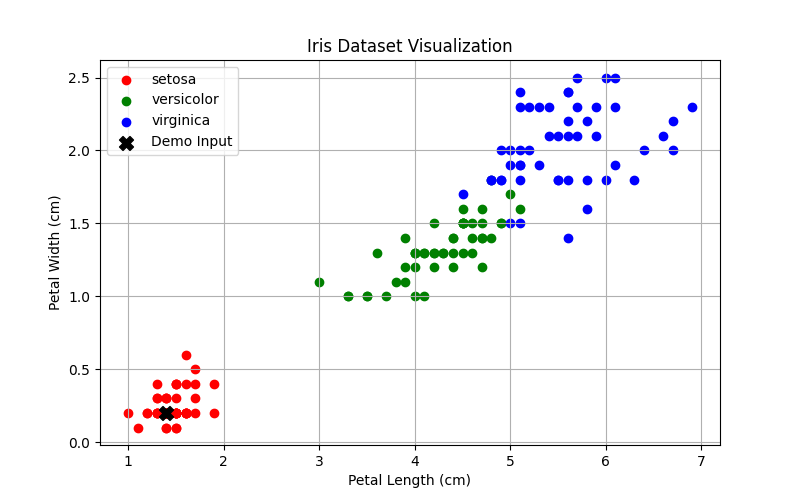
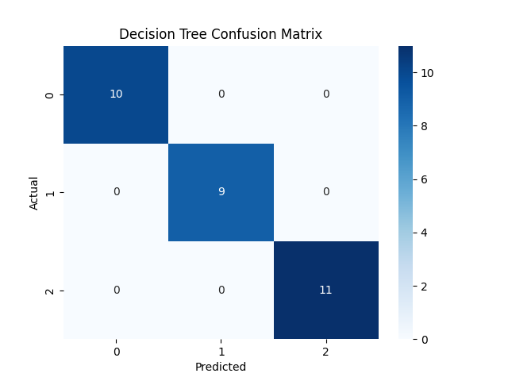
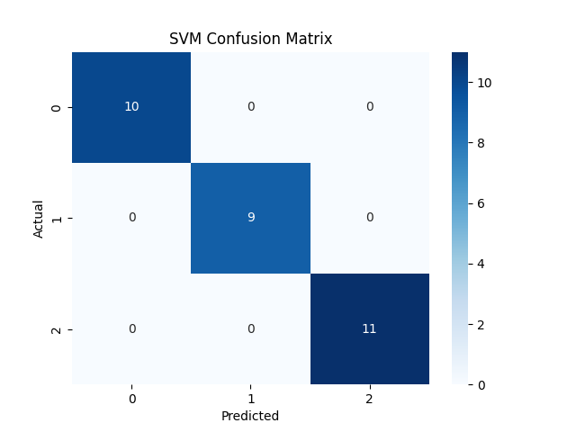
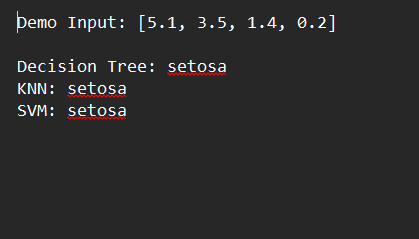

# 🌸 Iris Classification using Machine Learning

## 📌 Description
This project uses ML models to classify iris flowers into three species:
- Setosa
- Versicolor
- Virginica

## 🤖 Models Used
- Decision Tree
- K-Nearest Neighbors (KNN)
- Support Vector Machine (SVM)

## 📊 Features
- Accuracy comparison
- Confusion Matrix
- Classification Report
- User input prediction
- Data visualization

## 🛠️ Technologies
- Python
- NumPy
- Scikit-learn
- Matplotlib
- Seaborn

## 🎥 Demo

### 📈 Visualization


### 📊 Confusion Matrix (Decision Tree)


### 📊 Confusion Matrix (KNN)


### 📊 Confusion Matrix (SVM)


### 🔮 Prediction Output


## 🚀 How to Run
```bash
python iris_data_set5.py
